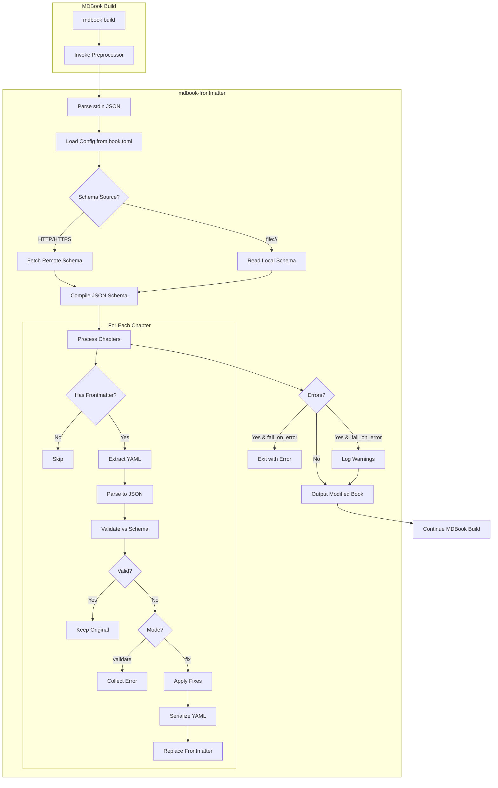

# Data Flow

## Overview



## Input Format

MDBook sends a JSON object via stdin:

```json
{
  "root": "/path/to/book",
  "config": {
    "book": { ... },
    "preprocessor": {
      "frontmatter": {
        "schema": "https://...",
        "mode": "validate"
      }
    }
  },
  "renderer": "html",
  "mdbook_version": "0.4.52"
}
```

Followed by the book content:

```json
{
  "sections": [
    {
      "Chapter": {
        "name": "Chapter 1",
        "content": "---\ntitle: ...\n---\n\n# Content",
        "path": "chapter-1.md",
        ...
      }
    }
  ]
}
```

## Output Format

The preprocessor outputs the modified book to stdout:

```json
{
  "sections": [
    {
      "Chapter": {
        "name": "Chapter 1",
        "content": "---\ntitle: Fixed Title\n---\n\n# Content",
        ...
      }
    }
  ]
}
```

## Frontmatter Processing

### Extraction

1. Check if content starts with `---`
2. Find closing `---` marker
3. Extract YAML between markers
4. Parse YAML to serde_json::Value

### Validation

1. Apply JSON Schema validation
2. Collect all validation errors
3. Format errors with chapter context

### Fixing (fix mode)

1. Check for missing required fields
2. Add defaults from schema if available
3. Coerce types where unambiguous
4. Re-serialize to YAML
5. Replace original frontmatter
